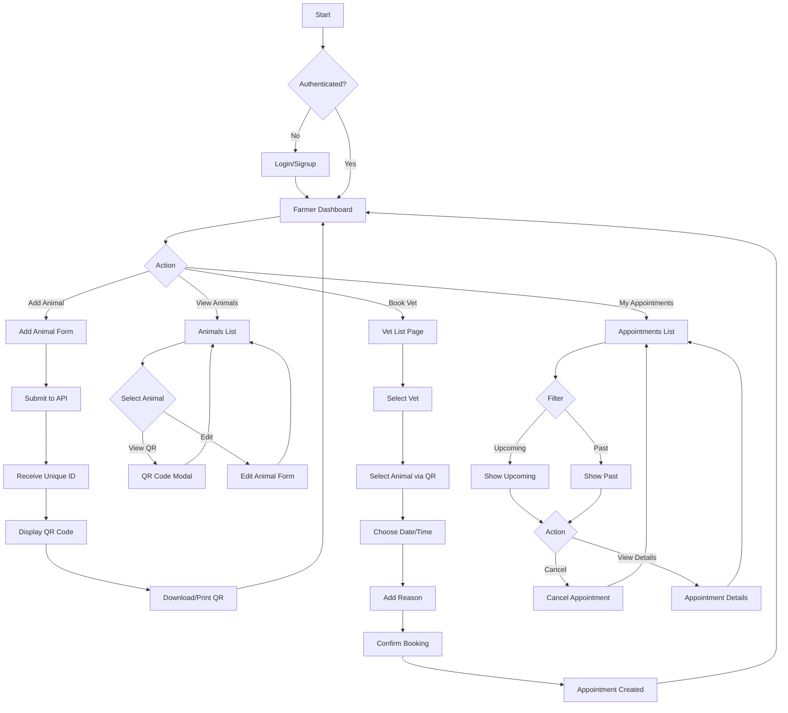
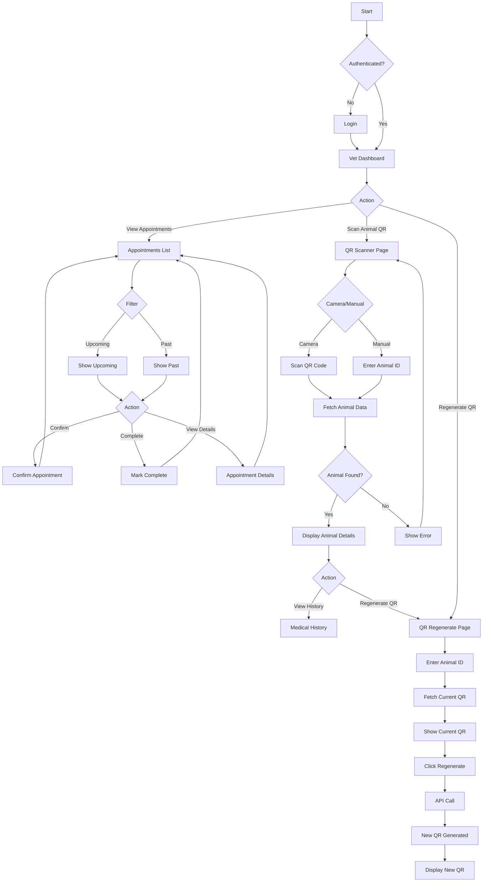
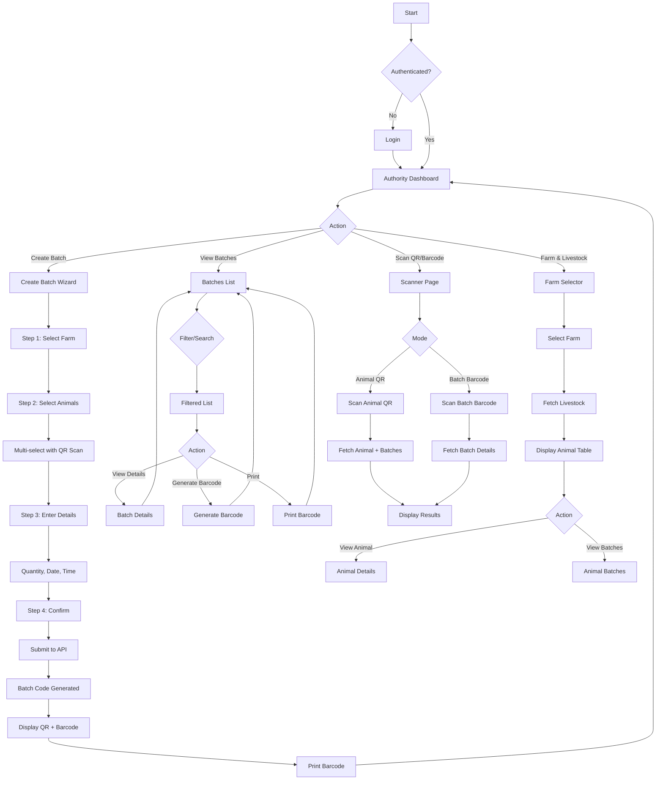
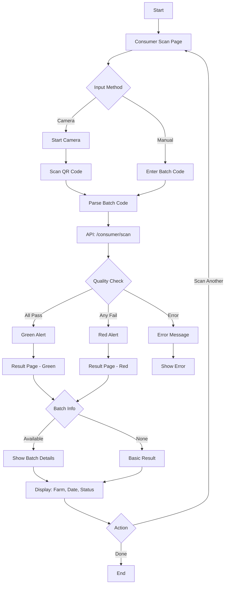
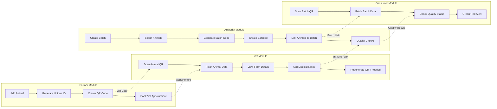

# Agri Farm - User Flow Diagrams

This document contains Mermaid flow diagrams for all major user journeys in the Agri Farm application.

---

## 1. Farmer Journey



---

## 2. Veterinarian Journey



---

## 3. Authority Journey



---

## 4. Consumer Journey



---

## 5. Cross-Module Data Flow



---

## 6. QR/Barcode Data Structures

### Animal QR Code
```json
{
  "type": "animal",
  "uniqueId": "ANM-001",
  "farmId": "FARM-001"
}
```

### Batch Barcode
```json
{
  "type": "batch",
  "batchCode": "BATCH-001"
}
```

### Consumer Scan URL
```
/consumer/scan?batchCode=BATCH-001
```

---

## 7. API Integration Points

| Module | Endpoint | Purpose |
|--------|----------|---------|
| Auth | POST /auth/login | User authentication |
| Auth | POST /auth/signup | User registration |
| Farmer | GET /farmer/animals | List animals |
| Farmer | POST /farmer/animals | Create animal |
| Farmer | GET /farmer/animals/:id/qr | Get animal QR |
| Farmer | GET /vets/nearby | Find nearby vets |
| Farmer | POST /appointments | Book appointment |
| Farmer | GET /farmer/appointments | List appointments |
| Vet | GET /vet/appointments | List vet appointments |
| Vet | PATCH /vet/appointments/:id/confirm | Confirm appointment |
| Vet | GET /animals/:uniqueId | Get animal by QR |
| Vet | POST /animals/:id/regenerate-qr | Regenerate QR |
| Authority | POST /batches | Create batch |
| Authority | GET /batches/:batchCode | Get batch details |
| Authority | POST /batches/:batchCode/barcode | Generate barcode |
| Authority | GET /farms/:id/livestock | Get farm animals |
| Authority | GET /animals/:uniqueId/batches | Get animal batches |
| Consumer | GET /consumer/scan?qrData= | Check batch quality |

---

## 8. State Transitions

### Appointment Status
```
pending → confirmed → completed
    ↓
cancelled
```

### Batch Quality Status
```
pending → pass
    ↓
fail
```

### Animal Health Status
```
Healthy ↔ Check-up Due ↔ Under Treatment ↔ Critical
```

---

*Generated for Agri Farm Frontend v1.0*